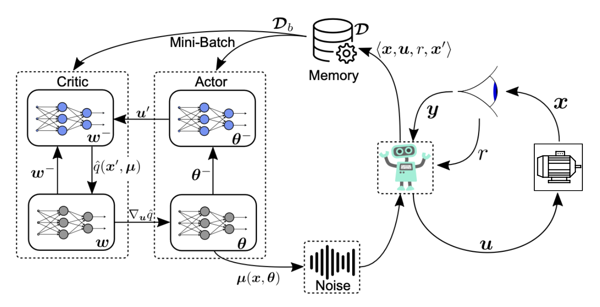
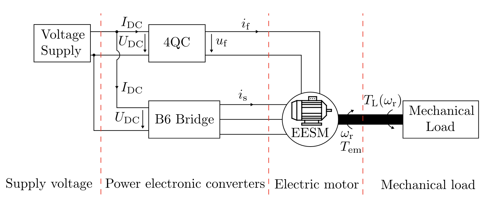
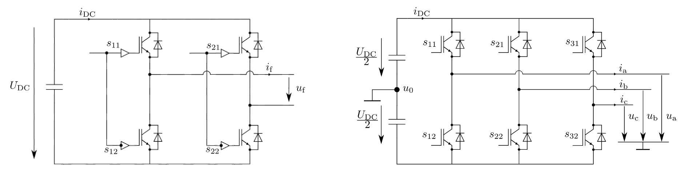
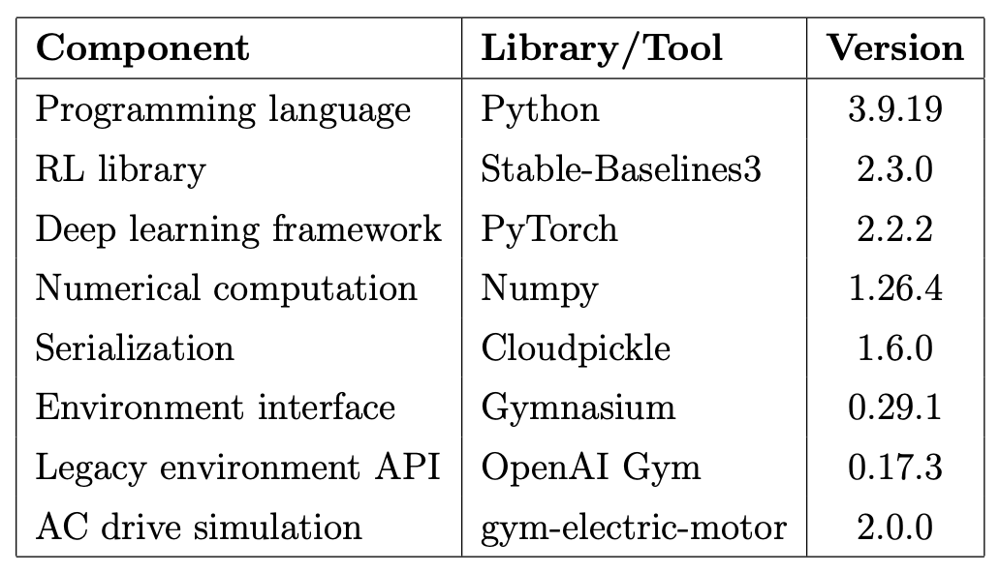
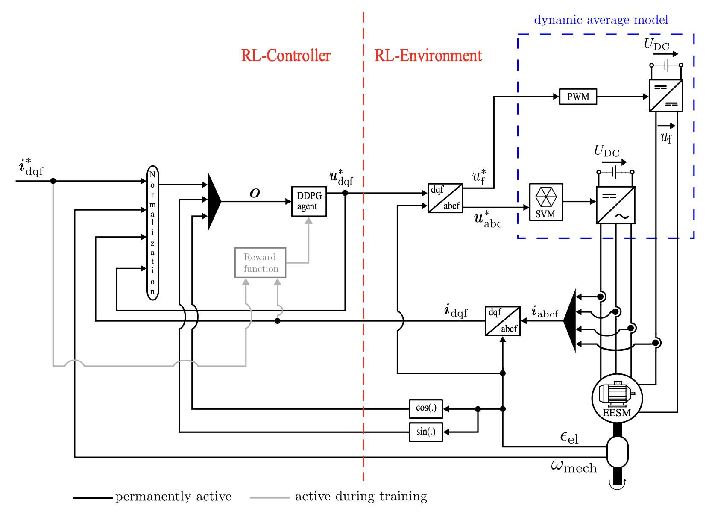
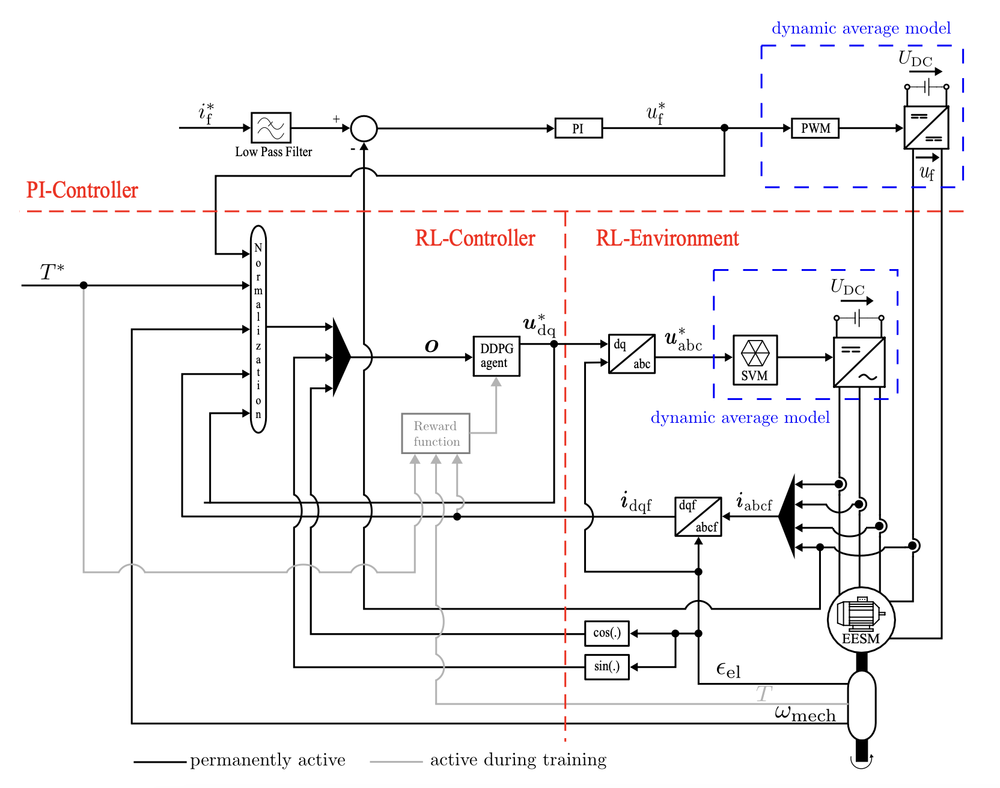
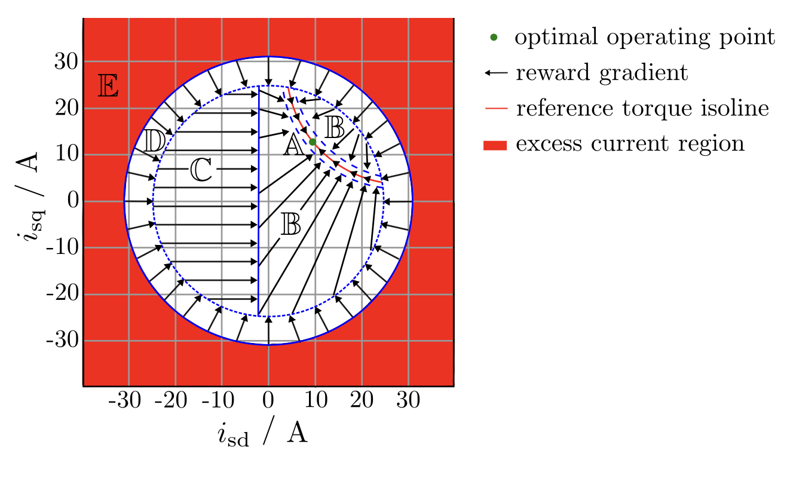
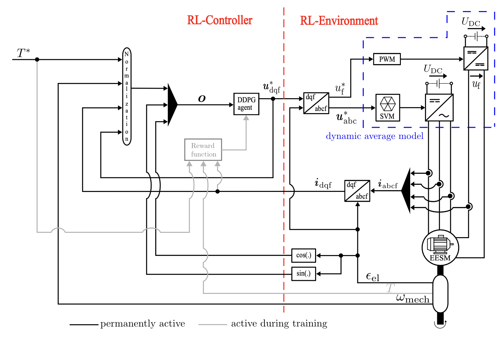
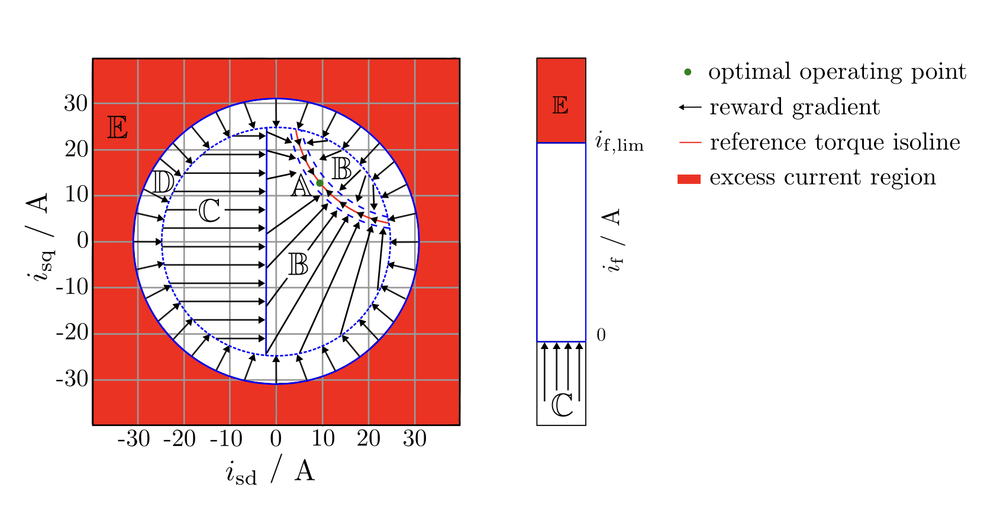

# Optimal Torque Control of EESM using RL

This project presents an initial proof of concept demonstrating that Externally Excited Synchronous Machines (EESMs) can be controlled using Reinforcement Learning (RL), specifically through the Deep Deterministic Policy Gradient (DDPG) algorithm for Continuous Control Set (CCS) operation.

This work originates from the author's master’s thesis and was later published as a conference paper at the IEEE International Electric Machines & Drives Conference (IEMDC) 2025. The original thesis can be accessed here: [Master Thesis](https://scholar.google.com/citations?view_op=view_citation&hl=en&user=LTkXyr8AAAAJ&citation_for_view=LTkXyr8AAAAJ:u-x6o8ySG0sC), and the conference paper is available on IEEE Xplore: [IEEE Paper](https://ieeexplore.ieee.org/document/11061093).

---

## Project Structure
The project is organized into five steps, corresponding to five work packages (WP01–WP05). Each work package corresponds to its own chapter or section in the thesis.

---

### WP01: Introduction to DDPG and EESM

<p align="center">
  <b>Visual Summary of DDPG Working Principle</b><br>
  <br>
  Interaction between the DDPG agent and the EESM environment
</p>

<p align="center">
  <b>Gym Electric Motor Toolbox</b><br>
  <br>
  Simplified structure diagram of an electric drive system
</p>

<p align="center">
  <b>Power Electronic Converters Modeling</b><br>
  <br>
  (Left) Four quadrant converter  (Right) B6 bridge converter
</p>

<p align="center">
  <b>Software Components and Versions</b><br>
  <br>
</p>
Install dependencies using:

```bash
pip install -r requirements.txt
```

---

## WP02: CCS Current Control

<p align="center">
  <b>Schematic of Overall CCS Current Control Structure</b><br>
  
</p>

WP02 is the simulation file for CCS current control where current control of EESM is conducted. Mean error with more weight on excitation current is used for reward design. The standard deviation of Gaussian noise sample is changing with respect to time to address the exploration-exploitation dilemma.

```bash
jupyter notebook WP02_EESM_Transformation_CurrentControl.ipynb
```

---

## WP03: PI-assisted RL Control

<p align="center">
  <b>Schematic of the Overall CCS Torque Control Structure with PI Controller</b><br>
  
</p>

<p align="center">
  <b>Schematic of Reward Design (adapted from PMSM)</b><br>
  
</p>

WP03 is the CCS torque control where PI-regulated excitation circuit and RL-regulated stator circuit are analysed. The basic and simple PI controller is implemented and the voltage limitation for rotor circuit is removed. The PMSM reward design is adapted. Torque knowledge is not available to the agent after the training period. The same noise behaviour is used. 

```bash
jupyter notebook WP03_EESM_Transformation_PI_RL_integrated.ipynb
```

---

## WP04: Performance Priority Control

<p align="center">
  <b>Schematic of Overall CCS Torque Control Structure with RL-based Excitation Circuit</b><br>
  
</p>

<p align="center">
  <b>Schematic of the Reward Design Approach for Performance Priority Control</b><br>
  
</p>

WP04 is the CCS torque control with performance priority strategy. The PMSM reward design is integrated with excitation current limitation for the reward design. The same noise behaviour is utilised.

---

## WP05: Efficiency Priority Control

WP05 is the CCS torque control with efficiency priority method. The efficiency calculation is considered and reflected to the reward design. Same noise behaviour as above is used.

---

## Note

For all of the above simulation, the gym-electric-motor 2.0.0 is used as a basis to exchange the EESM and the uploaded EESM file; `externally_excited_synchronous_motor.py` is used as a transformation branch of GEM. The other libraries and their respective version are mentioned in the document. Then, for the (dq_to_abc_action_processor) and (cos_sin_processor),  the uploaded ones; `dq_to_abc_action_processor.py` and `cos_sin_processor.py` in this repository are used.

All results and implementation details can be found in the two documents referenced at the beginning.

---

## Citation

To acknowledge the use of this work, please cite the following publications:

```bibtex
@INPROCEEDINGS{11061093,
  author={Haucke-Korber, Barnabas and Aung, Nyi Nyi and Schenke, Maximilian and Peña, Mario and Jakobeit, Darius and Wallscheid, Oliver},
  booktitle={2025 IEEE International Electric Machines & Drives Conference (IEMDC)}, 
  title={Reinforcement Learning-based Direct Torque Control of Externally Excited Synchronous Motors: a Proof of Concept}, 
  year={2025},
  volume={},
  number={},
  pages={916-921},
  keywords={Couplings;Torque;Torque control;Circuits;Rotors;Reinforcement learning;Stators;Predictive models;Synchronous motors;Integrated circuit modeling;Artificial intelligence;externally exited synchronous motor;optimal control;reinforcement learning;torque control},
  doi={10.1109/IEMDC60492.2025.11061093}}
```

```bibtex
@mastersthesis{Aung2024EESM,
  author       = {Nyi Nyi Aung},
  title        = {Optimal Torque Control of Externally Excited Synchronous Motors by Reinforcement Learning},
  school       = {Universidad de Oviedo},
  year         = {2024},
  address      = {Oviedo, Spain},
  month        = {July},
  url          = {https://hdl.handle.net/10651/75072},
  note         = {Master Thesis, Máster Erasmus Mundus en Transporte Sostenible y Sistemas Eléctricos de Potencia}
}
```
